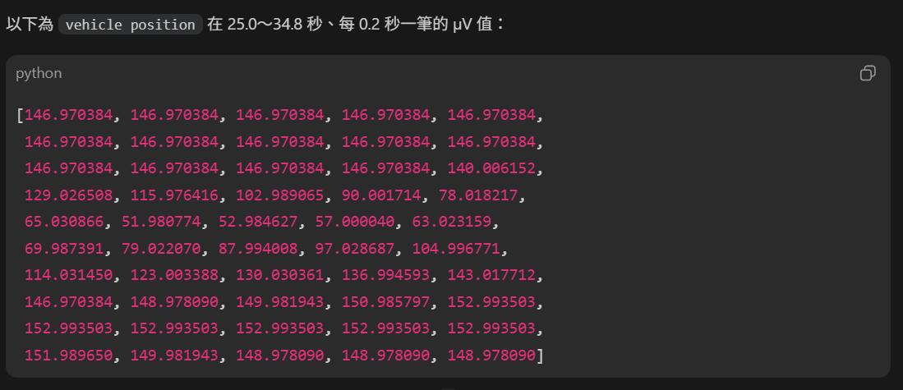
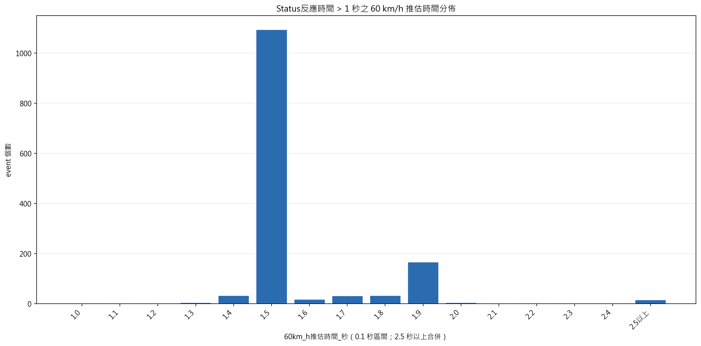
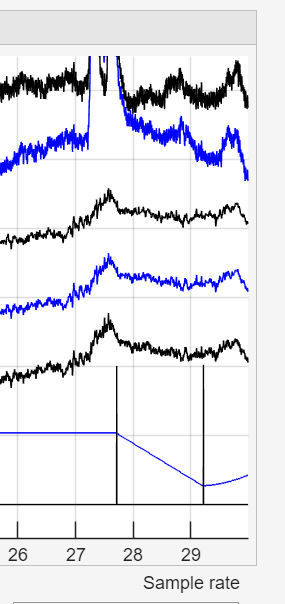

# 基於 EEG 與眼動訊號之疲勞駕駛預測演算法

> A Drowsy Driving Prediction Algorithm Based on EEG and Eyeblink Signals

作者：許成豪（Cheng-Hao Xu）、潘亮銓（Liang-Chuan Pan）<br>
國立成功大學資訊工程學系<br>
指導教授：梁勝富

本文件分為兩個部分：[第一部分](#第一部分研究介紹)以論文架構說明研究背景、方法與結果；[第二部分](#第二部分repository-使用方式)說明如何安裝、執行及延伸本 repository。

---

## 第一部分：研究介紹

### 摘要

疲勞駕駛對道路安全造成重大威脅，然而影像辨識與車輛偏移等常見方法，多半在駕駛者已出現明顯疲勞行為後才發出警示。本研究提出一套結合腦電圖（Electroencephalography, EEG）Alpha 波與眼動／眨眼（eyeblink）訊號的兩階段疲勞駕駛預測演算法，期望在行為性疲勞發生前提供預警。

第一階段利用駕駛開始後前 300 秒的車道偏移反應時間（Reaction Time, RT）進行安全篩檢，排除已呈現高風險疲勞狀態的資料，並為通過篩檢的駕駛者建立個人化 RT 基準。第二階段自第 301 秒起，以 30 秒眼動與 Alpha 特徵窗口持續評估生理疲勞，並與第一個由後續 90 秒確認的行為疲勞 onset 比較，以計算是否成功預測及提前時間。

論文原稿報告的 12 筆訓練資料中，有 5 筆在第一階段被判定為高風險並排除；其餘 7 筆中有 6 筆成功在行為性疲勞前發出警報，成功率為 85.7%。這些數字來自先前使用 60 秒重複 RT 事件與個人化 Alpha Power 中位數門檻的版本；目前程式已改用 Local RT 與往後 90 秒的 Forward Global RT，並移除 Alpha 個人化門檻，須重新執行資料分析後才能更新成效數字。

**關鍵詞：** 疲勞駕駛、腦電圖、Alpha 波、眼動、眨眼、反應時間、個人化預警

### 1. 緒論

疲勞會降低駕駛者的注意力、反應速度與車輛控制能力，是重大交通事故的重要風險因子。現有疲勞偵測方法常使用臉部或眼部影像、車輛軌跡，或 EEG 中與嗜睡相關的頻帶特徵，但仍存在若干限制：影像辨識容易受到眼鏡、口罩、姿勢與環境光線影響；車輛偏移分析通常要等到操控表現已經惡化；接近睡眠時才明顯出現的生理特徵，也較難滿足提前預測的需求。

為改善上述問題，本研究以模擬駕駛中的 RT 作為行為性疲勞依據，並以 FP2 通道取得眼動及 EEG 頻帶特徵。研究的主要設計包括：

1. 先以短期行為資料判斷駕駛者是否已處於不適合繼續駕駛的狀態。
2. 對通過初始篩檢者建立個人化 RT 基準，降低反應時間的個體差異。
3. 結合眼動減少與 Alpha 特徵增加兩種生理變化，在行為反應明顯變慢前發出警報。

### 2. 研究方法

#### 2.1 資料集

本研究使用 Cao 等人公開的 *Multi-channel EEG Recordings During a Sustained-Attention Driving Task* 資料集。資料包含模擬持續注意力駕駛任務中的 32 通道 EEG 與車道偏移反應紀錄，可用於比較生理訊號變化與駕駛行為表現。

論文原稿的資料集段落記載選用 14 筆受試者資料；摘要與結果段落目前則針對 12 筆訓練資料報告成效。因此，本 README 的實驗結果採用原稿已明列的 12 筆統計，兩者的資料納入條件仍應在正式投稿版本中統一。

#### 2.2 疲勞事件定義

RT 定義為車輛開始偏移至駕駛者開始導正之間的時間。系統使用 EDF `Status` 通道中的 251／252 表示偏移開始、253 表示導正開始、254 表示導正完成；事件時間向上取整至整秒，RT 則以一般四捨五入記錄至小數點第一位。

為建立行為性疲勞標準，本研究分析車輛橫跨一個車道所需時間，並由模擬 100 km/h 的結果換算至 60 km/h。多數事件約落在 1.5 秒，因此第一階段採用固定 RT 門檻：

```text
Phase 1 RT threshold = 1.6 秒
```

<table>
  <tr>
    <td width="50%"></td>
    <td width="50%"></td>
  </tr>
</table>

圖 1．模擬駕駛中的車輛位置，以及換算至 60 km/h 後的車道跨越時間分布。

#### 2.3 第一階段：安全篩檢與個人化 RT 基準

系統從第 0 秒開始依序檢查 RT 事件。每個事件的 Local RT 是該次反應時間；當第 `s` 秒的 Local RT 達門檻時，以 `[s, s+90]` 內包含當次及後續事件的 Local RT 平均作為 Forward Global RT。只有 recording 至少涵蓋完整的 `s+90`，且窗口內至少還有一筆發生在較晚秒數的 RT，才具備確認資格。

若 `Local RT(s) >= 1.6` 且該事件的 Forward Global RT 也 `>= 1.6`，便將第 `s` 秒回標為行為疲勞 onset，確認時間則是 `s+90`。單次極長 RT 不再立即觸發。Onset 位於第 300 秒（含）以前時排除該筆 recording，不進入第二階段；因此 Phase 1 候選事件可以使用第 300 秒後的 RT 完成確認。

未達上述條件者可進入第二階段，並以其前 300 秒 RT 資料建立下列個人化基準：

- RT 平均數與中位數。
- 個人化 RT 疲勞門檻：`min(1.6, ceil_0.1(RT 平均數 × 1.5))`；`ceil_0.1` 表示向上取至小數第一位。

#### 2.4 眼動與 Alpha 特徵擷取

眼動與 EEG 頻帶特徵均取自 FP2 通道。眼動訊號先經 0.1–10 Hz 零相位濾波，再以訊號中位數與 MAD 建立動態高度門檻；候選峰值還必須符合局部最大值與 peak-to-shoulder 落差大於 70 μV 的條件。系統以偵測到眼動的「秒數」作為後續窗口統計單位。

Alpha 特徵先以 1–30 Hz 濾波，再對每個完整的一秒訊號執行 FFT，計算 Theta（4–7 Hz）、Alpha（8–12 Hz）與 Beta（13–20 Hz）的 Power。偵測到眼動的秒數會排除於 EEG 頻譜判定之外；其餘秒數只要符合 `Alpha > Theta` 且 `Alpha > Beta`，便記為一個 Alpha 特徵秒。功能二會以相同條件分析第 1 秒至分析終點，不再建立或套用個人化 Alpha Power 門檻。



圖 2．FP2 眼動訊號與事件標記範例。

#### 2.5 第二階段：第一個疲勞事件預測

系統沿用前 300 秒資料初始化滑動窗口，並自第 301 秒起逐秒更新下列特徵：

- `EyeWindow30`：最近 30 秒偵測到眼動的秒數。
- `AlphaWindow30`：最近 30 秒符合 `Alpha > Theta` 且 `Alpha > Beta` 的非眼動秒數。

兩個窗口分別使用前 300 秒建立的 robust median 與 scale 轉成 `Z_Eye` 及 `Z_Alpha`，其中眼動減少是疲勞方向，因此反轉符號。Scale 優先使用該筆資料的 MAD，其次使用 IQR；兩者皆為 0 時，使用已凍結的訓練 pooled fallback 常數：Alpha `1.4826`、Eye `4.4478`。`function_two` 執行時不會為了取得這兩個值重新掃描 `train_data`，但仍可用 `--pooled-alpha-scale` 與 `--pooled-eye-scale` 覆寫。生理疲勞分數與正式警報條件為：

```text
Z_Alpha >= 0.8 且 Z_Eye >= 0.8
上述兩項同時連續成立 4 秒
```

第 300 秒後，系統從第一個 `Local RT >= 個人化門檻` 的異常事件開始檢查其 `[s, s+90]` Forward Global RT；兩者皆達門檻時，將 `s` 定義為 Behavioral Fatigue Onset，並將 `s+90` 記為 confirmation。觸發原因為 `LOCAL_AND_FORWARD_GLOBAL`。系統記錄第一次生理警報，並以「onset 時間減去第一次警報時間」計算提前秒數；Forward window 僅用於離線確認，生理預測仍以 onset 為目標。

```text
開始駕駛
   │
   ▼
前 300 秒 RT 安全篩檢
   ├─ 找到 Local RT >= 1.6 的異常起點 s
   ├─ 檢查 [s, s+90] Forward Global RT
   ├─ Forward Global RT >= 1.6 → onset=s／停止
   └─ 通過篩檢
          │
          ▼
建立個人化 RT 基準
          │
          ▼
第 301 秒起逐秒更新
├─ EyeWindow30
└─ AlphaWindow30
          │
          ▼
Z_Alpha與Z_Eye皆 >= 0.8，連續 4 秒
          │
          ▼
發出警報，並與第一個 Local+Forward Global onset 比較
```

### 3. 實驗結果

下表保留論文原稿中使用個人化 Alpha Power 中位數門檻所得的訓練資料結果，僅供追溯；目前非個人化 Alpha 實作的結果尚待重新執行實驗後更新：

| 評估項目 | 結果 |
| --- | ---: |
| 納入結果統計的訓練資料 | 12 筆 |
| 第一階段判定高風險並排除 | 5 筆 |
| 進入第二階段 | 7 筆 |
| 成功提前預警 | 6 筆 |
| 提前預警成功率 | 85.7% |
| 成功案例提前時間 | 67–482 秒 |
| 提前時間中位數 | 121.5 秒 |

其中一筆代表性資料在第 549 秒出現第一次生理警報，行為性疲勞則於第 821 秒發生，提前時間為 272 秒。這些結果屬於訓練資料上的初步驗證，尚不能視為獨立測試集上的泛化效能。

### 4. 討論與結論

論文原稿結果顯示，在以 RT 排除初始高風險駕駛者後，眼動減少與 Alpha 特徵增加具有辨識行為性疲勞前生理變化的潛力。目前實作仍保留個人化 RT 門檻，但 Alpha 改為只使用頻帶優勢條件；移除 Alpha 個人化後的警報時間、成功率與誤報率需要重新評估。

目前研究仍受限於樣本數較少、結果來自訓練資料、僅使用 FP2 通道，以及固定窗口與警報門檻可能不適合所有駕駛者。後續工作應統一資料納入數量、加入獨立測試或交叉驗證、分析誤報率，並評估更多 EEG 通道與生理／車輛特徵，以提升模型的穩健性與實際部署價值。

### 參考文獻

[1] M. J. Flores, J. M. Armingol, and A. de la Escalera, “Driver drowsiness detection system under infrared illumination for an intelligent vehicle,” *IET Intelligent Transport Systems*, vol. 5, no. 4, pp. 241–251, 2011.

[2] Z. Cao, C.-H. Chuang, J.-K. King, et al., “Multi-channel EEG recordings during a sustained-attention driving task,” *Scientific Data*, vol. 6, article 19, 2019.

---

## 第二部分：Repository 使用方式

### 1. 執行環境

建議使用 Python 3.10 以上版本，並在專案根目錄建立虛擬環境：

```powershell
python -m venv .venv
.\.venv\Scripts\Activate.ps1
python -m pip install --upgrade pip
python -m pip install mne numpy pandas matplotlib openpyxl pyedflib scipy
```

圖形介面使用 Tkinter；Windows 的一般 Python 安裝通常已包含 Tkinter，其他作業系統可能需要另外安裝對應的 `tk` 套件。

### 2. 輸入資料

主要流程接受 EDF 格式的多通道訊號，至少需要：

- `FP2`：眼動與 EEG 頻帶分析。
- `Status`：解析車道偏移及導正事件。
- `Status` 事件碼：251／252 為偏移開始、253 為導正開始、254 為導正完成。

建議將一般 EEG 放在 `data/raw_edf/eeg/`。含 `vehicle position` 通道的輔助 EDF 可放在 `data/raw_edf/auxiliary/`，供車道跨越時間工具使用。

專案中的 DAT 採逗號分隔格式；第一個整數是事件筆數，其餘整數是事件發生秒數：

```text
3,15,48,120
```

### 3. 快速開始：批次執行 train_data

請在 repository 根目錄執行：

```powershell
python -m eeg_analysis.fatigue_driving_prediction_system.function_two
```

不帶 `--file` 時，程式會讀取 repository 根目錄的 `train_data`，依清單順序在 `data/raw_edf/eeg/` 中遞迴尋找 `<record_id>_raw.EDF`，逐筆執行 Phase 1 與 Phase 2。每筆資料使用獨立輸出資料夾：

```text
data/derived/fatigue_driving_prediction_system/<record_id>/
```

即使某筆資料未通過 Phase 1，仍會匯出該筆 `function_two_results.xlsx`，並將 Phase 2 狀態記為 `SKIPPED_FUNCTION_ONE_NOT_PASSED`。單筆找不到EDF或分析失敗時會記錄錯誤並繼續下一筆；全部處理後另輸出：

```text
data/derived/fatigue_driving_prediction_system/training_batch_results.xlsx
```

可用參數指定其他清單、EDF資料夾或輸出根目錄：

```powershell
python -m eeg_analysis.fatigue_driving_prediction_system.function_two `
  --manifest <train_data路徑> `
  --edf-dir <EDF資料夾> `
  --results-root <批次輸出資料夾>
```

### 4. 分析單一 EDF

```powershell
python -m eeg_analysis.fatigue_driving_prediction_system.function_two --file data/raw_edf/eeg/s11_060920_1n_raw.edf
```

`--file` 會切換回單筆模式，但仍依序執行並匯出 Phase 1、Phase 2。可搭配 `--output-dir <資料夾>` 指定該筆輸出位置。第二階段需要第一階段建立個人化 RT 與 robust 生理基準；只有 Phase 1 通過且所需 baseline 有效時，才會從第 301 秒進行完整 Phase 2 分析。

若只要執行 Phase 1，可使用：

```powershell
python -m eeg_analysis.fatigue_driving_prediction_system.function_one --file data/raw_edf/eeg/s11_060920_1n_raw.edf --function-one-only
```

### 5. 主要輸出

| 檔案 | 說明 |
| --- | --- |
| `training_batch_results.xlsx` | train_data每筆資料的EDF路徑、Phase 1／2狀態、行為onset、生理警報、提前時間與錯誤摘要。 |
| `reaction_time_events.xlsx` | 從 EDF 擷取的整段 RT 事件，以及 recording 結束秒數。 |
| `function_one_results.xlsx` | 第一階段逐事件 Local／Forward Global RT、forward window、確認秒與個人化 RT baseline。 |
| `rt_validation.png` | 前 300 秒 Local／Forward Global RT與固定門檻。 |
| `eyeblink.dat` | 第一階段偵測到的眼動秒數。 |
| `eyeblink_function_two.dat` | 從第 1 秒至第二階段終點的眼動秒數。 |
| `Alpha_function_two.dat` | 從第 1 秒至第二階段終點，符合頻帶優勢條件的非眼動 Alpha 秒數。 |
| `function_two_results.xlsx` | 第二階段摘要、逐秒生理特徵及第 300 秒後逐事件 Local／Forward Global RT、確認秒與觸發原因。 |
| `behavioral_rt_debug.png` | 兩階段 Local RT、Forward Global RT、active threshold 與 Phase 2 onset。 |
| `function_two_pre_fatigue_90s.png` | 第一個疲勞事件前 90 秒的眼動、Alpha 與標準化分數圖；沒有目標事件時不產生。 |

### 6. 單獨偵測眼動與 Alpha

```powershell
python -m eeg_analysis.detection.detect_alpha_and_eyeblink --file data/raw_edf/eeg/s01_061102n_raw.EDF
```

程式會在 EDF 所在資料夾產生 `eyeblink.dat` 與 `Alpha.dat`。如果已有眼動 DAT，亦可單獨執行 Alpha 偵測並排除眼動秒數：

```powershell
python -m eeg_analysis.detection.record_alpha --file <EDF路徑> --eye-dat <眼動DAT路徑> --end-second 300
```

### 7. 啟動駕駛狀態分析介面

舊版三模式介面：

```powershell
python -m eeg_analysis.driving_state.predict_algorithm
```

在介面中選擇事件 Excel、Alpha DAT 與眼動 DAT，即可檢視事件切片、整體趨勢，以及預測狀態與實際駕駛狀態的比較。事件 Excel 至少需要 `second` 與 `react_time` 兩個英文欄位。

與 `function_two` 共用目前判定標準的 Observe 介面：

```powershell
python -m eeg_analysis.statistics_30s_alpha_eyeblink_of_fatigue.observe
```

Observe 會將事件秒數向上取整、Local RT 以一般四捨五入取至小數第一位；個人化 RT 門檻由使用者在介面手動輸入，不會從前 300 秒自動計算。Pooled Alpha／Eye scale 也由介面輸入，預設帶入與 `function_two` 相同的 `1.4826`／`4.4478`，Observe 執行時不會讀取 `train_data`。行為疲勞從整段 recording 開始搜尋：對第 `s` 秒的 Local RT 異常，以包含當次事件的 `[s, s+90]` Forward Global RT 完成確認，單次 3.2 秒以上 RT 不再立即觸發。若 onset 在前 300 秒（含），圖上只顯示 Phase 1 行為疲勞、累積特徵與 RT，不顯示 Phase 2、生理疲勞標記或下方生理判定圖；RT 仍顯示至 `min(onset + 500秒, recording總時間)`。`reaction_time_events.xlsx` 現在包含整段 RT 與 recording duration，供 Observe 建立完整時間軸。結果圖與逐秒除錯 Excel 會輸出至 `eeg_analysis/statistics_30s_alpha_eyeblink_of_fatigue/data/observe/`。

### 8. 驗證與分析工具

```powershell
# Alpha 自動偵測與人工標註比較
python -m eeg_analysis.alpha_validation.alpha_validation data/raw_edf/eeg/s01_061102n_raw.EDF

# 眼動自動偵測與人工標註比較，並輸出分布圖
python -m eeg_analysis.eye_movement.eye_movement_validation --file data/raw_edf/eeg/s01_061102n_raw.EDF --distribution

# 檢視 EDF 標頭
python -m tools.fatigue_time_analysis.view_edf_header data/raw_edf/auxiliary/s01_060926_1n_car_position.EDF --header-only

# 分析車道跨越事件
python -m tools.fatigue_time_analysis.analyze_lane_crossing_events data/raw_edf/auxiliary/s01_060926_1n_car_position.EDF -o data/derived/new_lane_crossing_analysis.xlsx
```

### 9. 專案結構

```text
├─ data/
│  ├─ raw_edf/                         # EEG 與輔助原始 EDF
│  └─ derived/                         # 分析產生的 Excel、DAT 與圖表
├─ docs/
│  ├─ images/                          # README 與研究說明圖片
│  └─ 目錄整理說明.md                  # 完整輸入、輸出及工具說明
├─ eeg_analysis/
│  ├─ common/filters/                  # 共用訊號濾波器
│  ├─ detection/                       # Alpha 與眼動自動偵測
│  ├─ fatigue_driving_prediction_system/
│  │                                  # 兩階段疲勞駕駛預測流程
│  ├─ alpha_validation/                # Alpha 人工標註驗證
│  ├─ eye_movement/                    # 眼動驗證與分布分析
│  ├─ driving_state/                   # 駕駛狀態分析 GUI
│  └─ statistics_30s_alpha_eyeblink_of_fatigue/
│                                     # 疲勞事件前的窗口特徵統計
├─ tests/                              # 自動化測試
└─ tools/
   ├─ fatigue_time_analysis/           # 車道偏移與反應時間工具
   └─ experiments/                     # 實驗性／原型程式
```

### 10. 使用注意事項

- 所有 `python -m ...` 指令都應從 repository 根目錄執行。
- 主要兩階段流程要求 EDF 同時包含 `FP2` 與 `Status`；缺少必要通道時會停止執行。
- 第一階段若沒有可用 RT 事件、無法建立 RT baseline，或判定為疲勞，第二階段不會執行。
- 自動偵測輸出的 `Alpha.dat`、`eyeblink.dat` 與人工標註檔可能採不同命名方式，執行驗證工具前請確認路徑與檔名。
- 目前論文結果為訓練資料上的初步結果；本程式適合研究與離線分析，不應直接作為實際道路安全決策系統。

各模組的完整參數、輸入輸出格式與已知限制，請參考 [docs/目錄整理說明.md](docs/目錄整理說明.md)。
