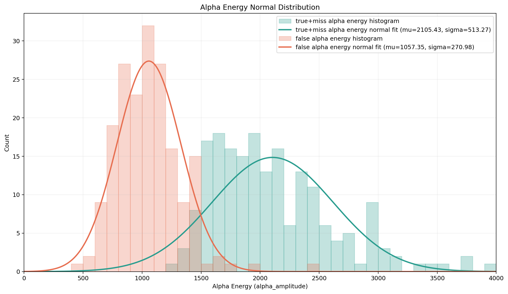
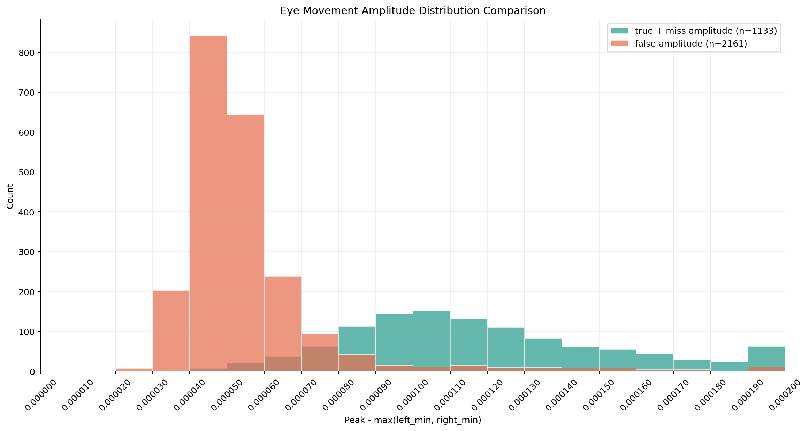

# 基於 EEG 與眼動訊號之疲勞駕駛預測系統

> Fatigue Driving Prediction System Based on EEG and Eye-Movement Signals

本專題利用駕駛者的反應時間、眼動訊號與 EEG Alpha 訊號，建立一套個人化疲勞駕駛預測系統。系統先利用開始駕駛後前 300 秒的反應時間，判斷駕駛者目前是否已經疲勞；若尚未疲勞，則使用這 300 秒建立個人化基準，並在 300 秒後持續分析眼動與 Alpha 訊號，以預測接下來發生的第一個疲勞事件，期望在反應時間明顯變慢以前提供警示。

指導教授：梁勝富<br>
專題成員：許成豪、潘亮銓

## 研究背景與動機

常見的疲勞駕駛偵測方法包括影像辨識、車輛偏移分析，以及 EEG θ 波偵測，但各有侷限：

- 影像辨識容易受眼鏡、口罩與環境光線變化影響。
- 車輛偏移通常須在車輛已出現明顯偏移後才能警示。
- θ 波多用於辨識已明顯疲勞或接近睡眠的狀態，較難提前預測。

因此，本研究將系統分成兩個功能：第一個功能確認駕駛者現在是否適合繼續駕駛；第二個功能則在駕駛者通過初始檢查後，利用個人化眼動與 Alpha 特徵，預測 300 秒後的第一個疲勞事件。

## 系統目標

### 功能一：確認目前能否繼續駕駛

系統觀察前 300 秒的車道偏移事件與 Reaction Time。Reaction Time 定義為車輛開始偏移至駕駛者開始導正之間的時間，並以一般四捨五入記錄至小數點第一位；當 Reaction Time 大於或等於 1.6 秒時，記為一個疲勞事件。出現第一個疲勞事件後，系統從下一個反應事件開始建立 60 秒窗口；如果窗口內又出現一個疲勞事件，就判定駕駛者已經疲勞，輸出禁止駕駛結果，不再進入後續預測流程。

### 功能二：預測第一個疲勞事件

若駕駛者通過功能一，系統會利用前 300 秒建立個人化 Reaction Time 與 Alpha Power baseline，Alpha採用符合頻帶優勢條件之Power中位數。從第 301 秒開始，系統每秒更新最近 30 秒的眼動累積值與最近 10 秒的 Alpha 特徵累積值；當 `EyeWindow30 < 10` 或 `AlphaWindow10 >= 3` 任一條件成立時即發出警報。功能二只評估第300秒後第一個個人化RT疲勞事件；當該事件發生後，這筆資料的預測流程即結束。

## 系統流程

```text
開始駕駛
   │
   ▼
前 300 秒：以 Reaction Time 判斷目前是否疲勞
   │
   ├─ 出現疲勞事件後，從下一個反應事件起算的 60 秒內又出現疲勞事件
   │      └─ 判定已疲勞 → 禁止駕駛 → 結束
   │
   └─ 未達疲勞條件
          │
          ▼
建立個人化 Baseline
├─ Reaction Time Baseline
├─ 眼動 Baseline
└─ Alpha Power Baseline
          │
          ▼
第 301 秒開始每秒分析
├─ 眼動：30 秒 sliding window
└─ Alpha：10 秒 sliding window
          │
          ▼
EyeWindow30 < 10 或 AlphaWindow10 >= 3
          │
          ▼
預測 300 秒後的第一個疲勞事件
          │
          ├─ 提前發出警告
          └─ 未成功預測
          │
          ▼
第一個疲勞事件發生 → 計算是否命中及提前秒數 → 結束
```

## 系統輸入與輸出

### 輸入

- EDF 格式的多通道 EEG 與 Status 訊號。
- FP2 通道的眼動與 EEG 訊號。
- 車道偏移開始時間與駕駛者開始導正時間，用來計算 Reaction Time。

### 輸出

- 功能一結果：允許繼續駕駛或禁止駕駛。
- 個人化 Reaction Time、眼動與 Alpha Power baseline。
- 個人化疲勞門檻：`min(1.6, RT baseline × 1.5)`。
- 300 秒後第一個疲勞事件的預測警告時間。
- 是否成功預測第一個疲勞事件，以及成功時可提前多少秒。

## 訊號與特徵摘要

- **Reaction Time**：車輛開始偏移至駕駛者開始導正之間的時間。
- **眼動訊號**：FP2 經 0.1–10 Hz 濾波後偵測眼動，每秒更新最近 30 秒的眼動累積次數。
- **EEG 頻帶**：FP2 經 1–30 Hz 濾波後，以每秒 FFT 計算 Theta（4–7 Hz）、Alpha（8–12 Hz）與 Beta（13–20 Hz）Power。
- **眼動排除**：偵測到眼動的秒數不進行 EEG 頻譜分析。
- **Alpha 特徵**：個人baseline使用前300秒合格Alpha Power的中位數。當 Alpha Power 同時大於 Theta Power、Beta Power及該中位數時，記錄該秒出現Alpha特徵，再以10秒sliding window累積。
- **功能二警報**：`EyeWindow30 < 10` 或 `AlphaWindow10 >= 3` 任一條件成立即觸發，並分別記錄眼動、Alpha或兩者共同觸發。
- **個人化疲勞事件**：300 秒後以 `min(1.6, RT baseline × 1.5)` 作為該駕駛者的 Reaction Time 疲勞門檻。

## 資料集與實驗設計

本研究使用持續注意力駕駛任務中的多通道 EEG 紀錄，將資料分為 **14 筆訓練資料**與 **9 筆測試資料**。訓練資料用來觀察第一個疲勞事件發生前的眼動與 Alpha 變化，並建立及調整預測規則；規則確定後，再使用測試資料進行最終驗證。

```text
23 筆 EEG 駕駛資料
   ├─ 14 筆訓練資料 → 建立及調整疲勞預測規則
   └─  9 筆測試資料 → 驗證第一個疲勞事件的預測效能
```

原始 EEG 資料位於 `data/raw_edf/`；特徵表、分析結果與圖表則依功能放置於 `data/`、`eeg_analysis/` 與 `tools/`。

## 實驗方法

### 1. 制定疲勞事件標準

參考陽明交通大學資料集的實驗設定：道路兩側距離與車輛軌跡均以 0–255 量化；每個車道寬度為 60 單位，共有 4 個車道。實驗場景的更新率則對應模擬 **100 km/h** 的行駛速度。

本研究先統計 9 筆資料中，車輛在 100 km/h 模擬速度下橫跨一個車道所需的時間，再換算為 **60 km/h** 下的橫跨時間。結果顯示，多數事件約落在 **1.5 秒**，因此將其作為反應時間的參考值。

<table>
  <tr>
    <td width="50%" rowspan="2" valign="middle">
      
    </td>
    <td width="50%">
      
    </td>
  </tr>
  <tr>
    <td width="50%">
      
    </td>
  </tr>
</table>

左圖為眼動訊號與事件標記；右上為車輛位置範例；右下為換算成 60 km/h 後的車道跨越時間分佈。

為了將邊界值與疲勞事件區分，後續分析採用下列定義：

- **疲勞事件**：反應時間 ≥ **1.6 秒**。


### 2. α 波偵測

α 波偵測使用未經處理的 EEG 資料，選取 FP1 與 FP2 通道後，依序進行 **1 Hz 高通濾波**與 **30 Hz 低通濾波**。每秒訊號經快速傅立葉轉換（FFT）後，以下列條件判定為 α 波：

```text
1. 在 1–30 Hz 範圍內的最高頻譜峰值，位於 8–12 Hz。
2. 該最高峰的振幅大於 1500。
```



圖：資料 `s01_060926_1n` 的 FP2 通道經 FFT 後，最高峰位於 8–12 Hz 時的振幅分佈。

### 3. 眼動訊號偵測

眼動訊號同樣使用未經處理的 EEG 資料，選取 FP1 與 FP2 通道後，進行 **0.1 Hz 高通濾波**與 **10 Hz 低通濾波**。判定條件如下：

```text
在 0.7 秒內，訊號峰值與谷值的差異 ≥ 70 μV。
```



圖：資料 `s01_060926_1n` 的 FP2 通道眼動訊號峰值與谷值差異分佈。

## 實驗結果

### 單一訊號偵測效能

| 訊號 | Precision | Recall |
| --- | ---: | ---: |
| 眼動偵測 | 90% | 70% |
| α 波偵測 | 90% | 90% |

### 疲勞預測效能

以 9 筆資料進行評估時，疲勞事件的偵測率（Recall）為 **57%**，預測準確率（Precision）為 **65%**。

| 評估資料 | 疲勞事件偵測率（Recall） | 預測準確率（Precision） |
| --- | ---: | ---: |
| 訓練 9 筆 | 57% | 65% |

## 專案結構

```text
├─ data/
│  └─ raw_edf/                         # EEG 與輔助原始 EDF 資料
├─ eeg_analysis/
│  ├─ detection/                       # α 波與眼動自動偵測
│  ├─ driving_state/                   # 駕駛狀態分析 GUI
│  ├─ fatigue_driving_prediction_system/
│  │                                    # 整合式疲勞駕駛預測系統
│  ├─ alpha_validation/                # α 波人工標註驗證
│  ├─ eye_movement/                    # 眼動驗證與分布分析
│  └─ statistics_30s_alpha_eyeblink_of_fatigue/
│                                       # 疲勞事件前訊號統計
├─ tools/
│  └─ fatigue_time_analysis/           # 車道偏移與反應時間分析工具
└─ docs/目錄整理說明.md                 # 完整目錄、輸入與輸出說明
```

## 使用方式

以下指令需在專案根目錄執行，並先安裝程式所需的 Python 套件，例如 `mne`、`numpy`、`pandas`、`matplotlib` 與 `openpyxl`。

### 執行功能一

```powershell
python -m eeg_analysis.fatigue_driving_prediction_system.function_one --file data/raw_edf/eeg/s11_060920_1n_raw.edf
```

功能一讀取 EDF 的 Status 與 FP2 通道，以 Status 251／252 作為車輛偏移開始、253 作為導正開始，並將事件時間向上取整至第 1～300 秒。出現第一個 `Reaction Time >= 1.6` 秒事件後，從下一個反應事件起算 60 秒；若窗口內又出現疲勞事件，就輸出疲勞結果，否則建立 Reaction Time 與 Alpha Power 的平均及中位數 baseline，並自動進入功能二。若只想執行功能一，可加上 `--function-one-only`。

### 執行功能二

```powershell
python -m eeg_analysis.fatigue_driving_prediction_system.function_two --file data/raw_edf/eeg/s11_060920_1n_raw.edf
```

功能二的獨立入口會先執行功能一；只有功能一判定為非疲勞時才繼續。功能二沿用前300秒資料初始化窗口，從第301秒起以 `EyeWindow30 < 10 OR AlphaWindow10 >= 3` 發出警報，並在第一個個人化RT疲勞事件停止。`eyeblink_function_two.dat`與`Alpha_function_two.dat`涵蓋第1秒至功能二分析終點，其中前300秒沿用功能一結果，301秒後接續功能二結果；另輸出`function_two_results.xlsx`及`function_two_pre_fatigue_30s.png`。若第300秒後沒有疲勞事件，則不產生疲勞前30秒圖。

### 偵測 α 波與眼動訊號

```powershell
python -m eeg_analysis.detection.detect_alpha_and_eyeblink --file data/raw_edf/eeg/s01_061102n_raw.EDF
```

程式會在 EDF 所在資料夾產生 `Alpha.dat` 與 `eyeblink.dat`。

### 啟動駕駛狀態分析介面

```powershell
python -m eeg_analysis.driving_state.predict_algorithm
```

介面需選擇事件 Excel、α 波 DAT 與眼動 DAT，可檢視事件切片、整體趨勢，以及預測與實際駕駛狀態的比較。

更完整的資料格式、各工具的輸入輸出與已知限制，請參考 [docs/目錄整理說明.md](docs/目錄整理說明.md)。

## 限制與後續方向

目前結果顯示，系統可從 α 波與眼動訊號中辨識部分疲勞事件，但疲勞預測的 Precision 與 Recall 仍有改善空間。後續可針對不同駕駛者調整個人化門檻，並加入更多資料與特徵，以降低誤報率、提升預測穩定性。
