# 基於 EEG 與 Eyeblink 之疲勞駕駛預測演算法

> Fatigue driving prediction algorithm based on EEG and Eyeblink

本專題以腦電圖（EEG）的 **α 波** 與 **眼動／眨眼訊號（Eyeblink）** 為基礎，預測駕駛者是否將進入疲勞狀態，並在疲勞事件發生前提供警示，以提升行車安全、降低事故風險。

指導教授：梁勝富<br>
專題成員：許成豪、潘亮銓

## 研究背景與動機

常見的疲勞駕駛偵測方法包括影像辨識、車輛偏移分析，以及 EEG θ 波偵測，但各有侷限：

- 影像辨識容易受眼鏡、口罩與環境光線變化影響。
- 車輛偏移通常須在車輛已出現明顯偏移後才能警示。
- θ 波多用於辨識已明顯疲勞或接近睡眠的狀態，較難提前預測。

因此，本研究結合眼動與 α 波兩項生理訊號，設計可提前預測疲勞駕駛事件的演算法。

## 系統流程

```text
EEG 原始資料
   ├─ 濾波 → α 波偵測     ─┐
   └─ 濾波 → 眼動眨眼偵測 ─┘ → 疲勞判定 → 警示 → 恢復監測 → 結束
```

- 以 EDF 格式的多通道 EEG 資料為輸入，主要使用 FP1、FP2 等通道。
- α 波以 10 秒滑動視窗累積；眼動訊號以 30 秒滑動視窗累積。
- 以駕駛者對車道偏移事件的反應時間作為疲勞判定參考。
- 當生理訊號達到演算法門檻時，系統發出疲勞警示，並持續監測恢復狀態。

## 資料集與實驗設計

本研究使用持續注意力駕駛任務中的多通道 EEG 紀錄，以 **9 筆資料**建立疲勞事件與生理訊號的判定門檻，並進行效能評估。

```text
9 筆 EEG 駕駛資料
   └─ 建立疲勞標準、驗證訊號偵測與評估疲勞預測效能
```

原始 EEG 資料位於 `data/raw_edf/`；特徵表、分析結果與圖表則依功能放置於 `data/`、`eeg_analysis/` 與 `tools/`。

## 實驗方法

### 1. 制定疲勞事件標準

參考陽明交通大學資料集的實驗設定：道路兩側距離與車輛軌跡均以 0–255 量化；每個車道寬度為 60 單位，共有 4 個車道。實驗場景的更新率則對應模擬 **100 km/h** 的行駛速度。

本研究先統計 9 筆資料中，車輛在 100 km/h 模擬速度下橫跨一個車道所需的時間，再換算為 **60 km/h** 下的橫跨時間。結果顯示，多數事件約落在 **1.5 秒**，因此將其作為反應時間的參考值。

<table>
  <tr>
    <td width="50%" rowspan="2" valign="middle">
      
    </td>
    <td width="50%">
      
    </td>
  </tr>
  <tr>
    <td width="50%">
      
    </td>
  </tr>
</table>

左圖為眼動訊號與事件標記；右上為車輛位置範例；右下為換算成 60 km/h 後的車道跨越時間分佈。

為了將邊界值與疲勞事件區分，後續分析採用下列定義：

- **疲勞事件**：反應時間 ≥ **1.6 秒**。


### 2. α 波偵測

α 波偵測使用未經處理的 EEG 資料，選取 FP1 與 FP2 通道後，依序進行 **1 Hz 高通濾波**與 **30 Hz 低通濾波**。每秒訊號經快速傅立葉轉換（FFT）後，以下列條件判定為 α 波：

```text
1. 在 1–30 Hz 範圍內的最高頻譜峰值，位於 8–12 Hz。
2. 該最高峰的振幅大於 1500。
```


圖：資料 `s01_060926_1n` 的 FP2 通道經 FFT 後，最高峰位於 8–12 Hz 時的振幅分佈。

### 3. 眼動訊號偵測

眼動訊號同樣使用未經處理的 EEG 資料，選取 FP1 與 FP2 通道後，進行 **0.1 Hz 高通濾波**與 **10 Hz 低通濾波**。判定條件如下：

```text
在 0.7 秒內，訊號峰值與谷值的差異 ≥ 70 μV。
```


圖：資料 `s01_060926_1n` 的 FP2 通道眼動訊號峰值與谷值差異分佈。

### 4. 疲勞發生前的生理訊號分析

為找出疲勞前的訊號變化，本研究依上述規則標記疲勞區間，並統計相鄰疲勞區間之間包含多少個正常事件。

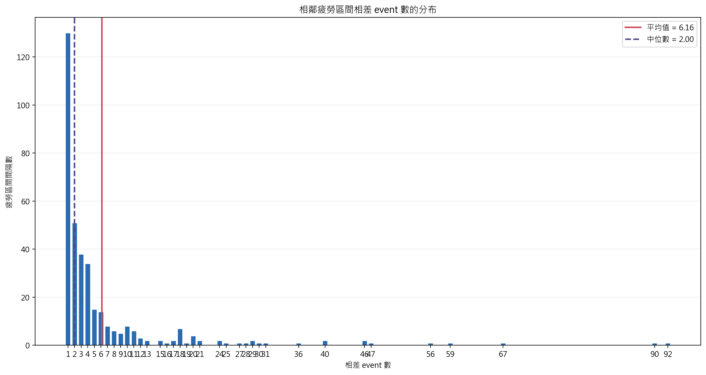

圖：相鄰疲勞區間之間的正常事件數分佈。

- **疲勞區段**：自第一個反應時間 ≥ **1.6 秒** 的事件開始。第一個反應時間 < **1.6 秒** 的事件視為恢復開始；其後連續 **60 秒** 內，所有有記錄的反應時間事件都必須 < **1.6 秒**，區段才於「恢復開始秒數 + 60 秒」結束。恢復期間只要任一反應時間事件 ≥ **1.6 秒**，便重新開始計算恢復時間。

接著彙整 9 筆資料中，每個疲勞區間開始前的眼動與 α 波分佈，以比較不同提前時間的訊號趨勢。

#### 疲勞區間開始前 30 秒

<p align="center">
  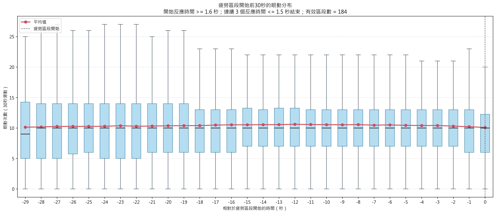
  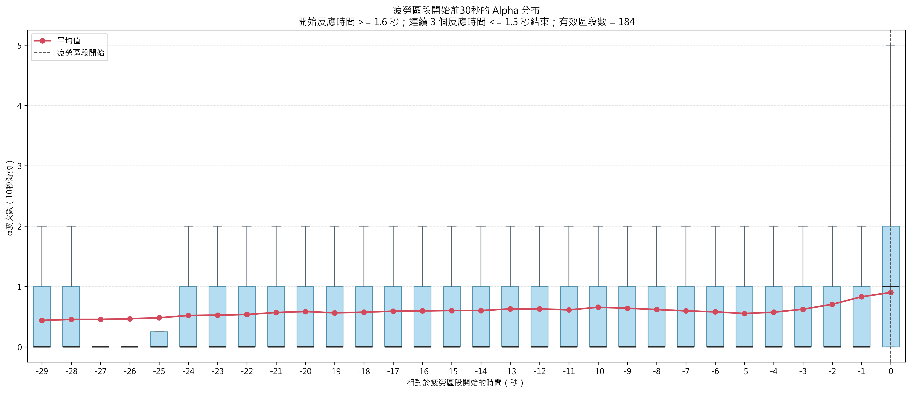
</p>

#### 疲勞區間開始前 29 秒

<p align="center">
  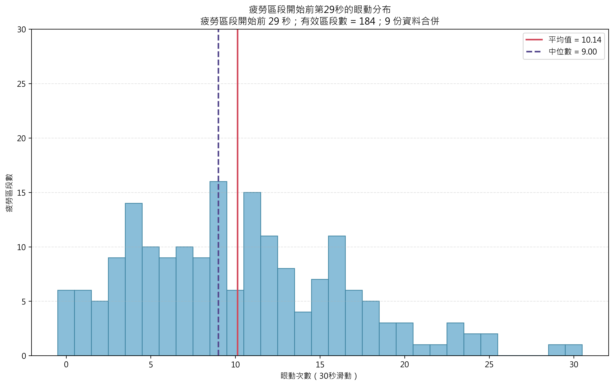
  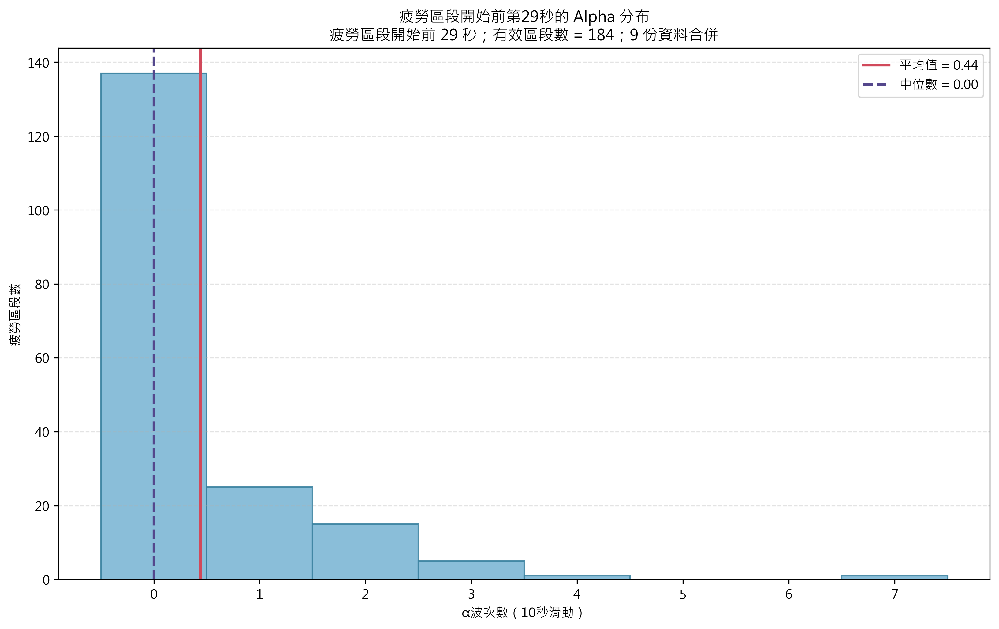
</p>

#### 疲勞區間開始前 25 秒

<p align="center">
  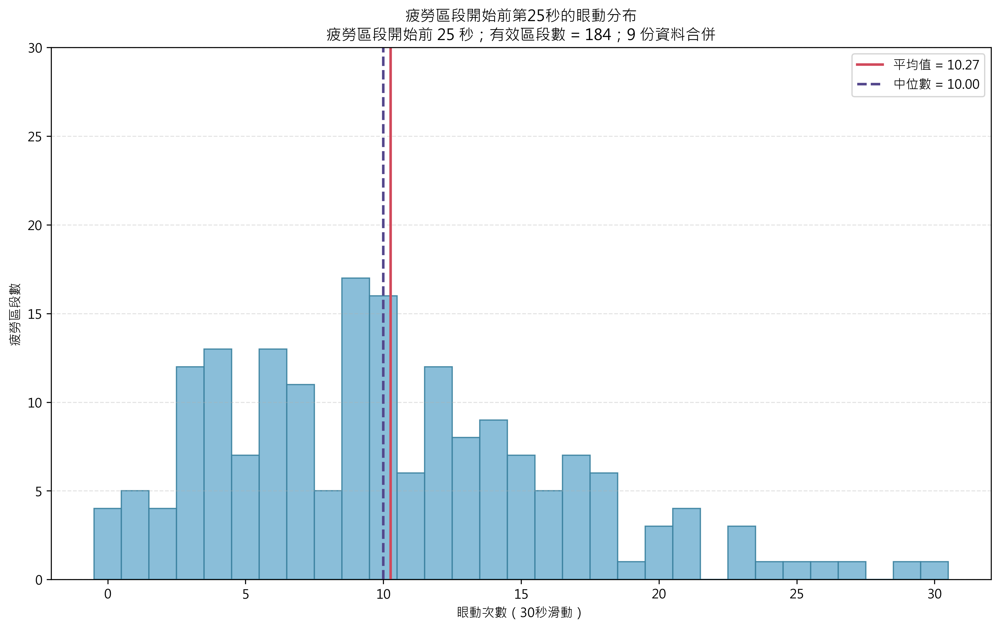
  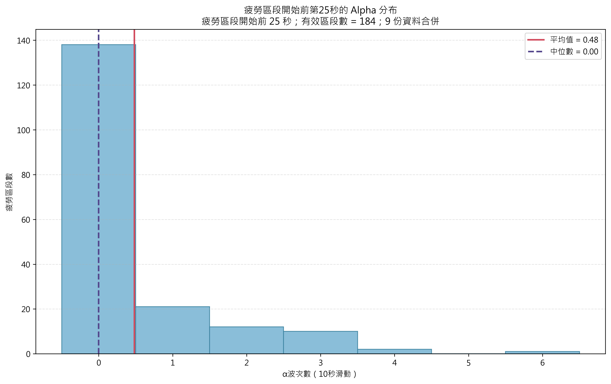
</p>

#### 疲勞區間開始前 15 秒

<p align="center">
  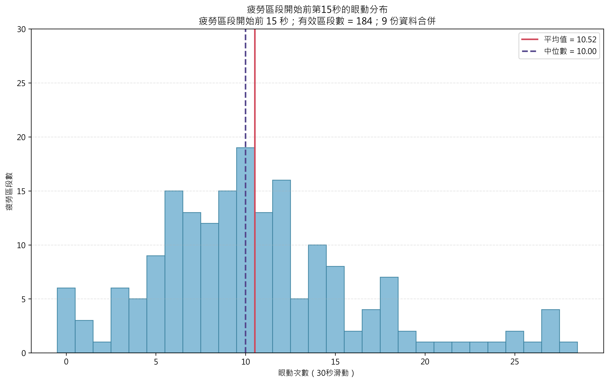
  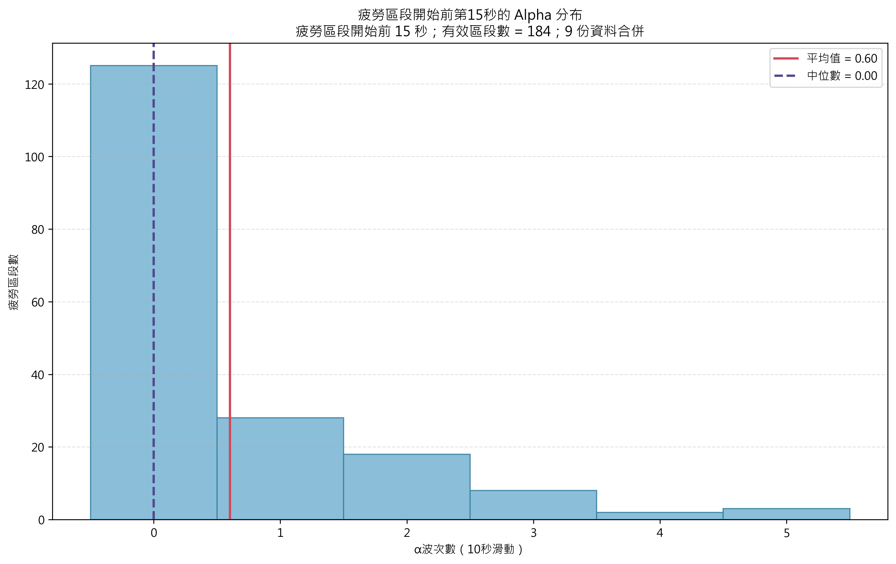
</p>

#### 疲勞區間開始前 5 秒

<p align="center">
  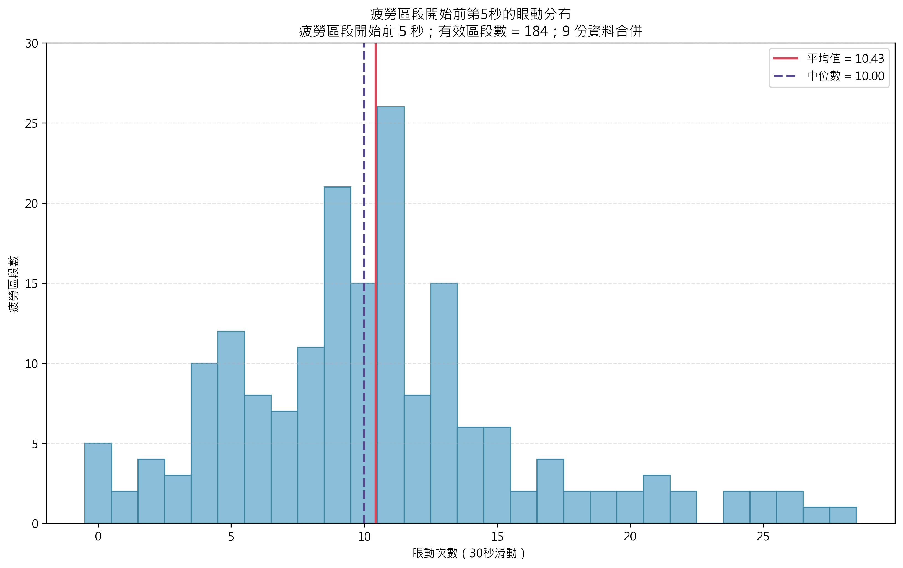
  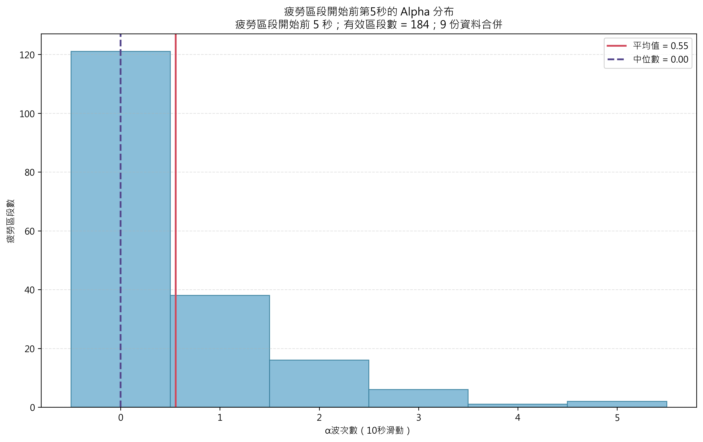
</p>

## 實驗結果

### 單一訊號偵測效能

| 訊號 | Precision | Recall |
| --- | ---: | ---: |
| 眼動偵測 | 90% | 70% |
| α 波偵測 | 90% | 90% |

### 疲勞預測效能

以 9 筆資料進行評估時，疲勞事件的偵測率（Recall）為 **57%**，預測準確率（Precision）為 **65%**。

| 評估資料 | 疲勞事件偵測率（Recall） | 預測準確率（Precision） |
| --- | ---: | ---: |
| 訓練 9 筆 | 57% | 65% |

## 專案結構

```text
├─ data/
│  └─ raw_edf/                         # EEG 與輔助原始 EDF 資料
├─ eeg_analysis/
│  ├─ detection/                       # α 波與眼動自動偵測
│  ├─ driving_state/                   # 駕駛狀態分析 GUI
│  ├─ alpha_validation/                # α 波人工標註驗證
│  ├─ eye_movement/                    # 眼動驗證與分布分析
│  └─ statistics_30s_alpha_eyeblink_of_fatigue/
│                                       # 疲勞事件前訊號統計
├─ tools/
│  └─ fatigue_time_analysis/           # 車道偏移與反應時間分析工具
└─ docs/目錄整理說明.md                 # 完整目錄、輸入與輸出說明
```

## 使用方式

以下指令需在專案根目錄執行，並先安裝程式所需的 Python 套件，例如 `mne`、`numpy`、`pandas`、`matplotlib` 與 `openpyxl`。

### 偵測 α 波與眼動訊號

```powershell
python -m eeg_analysis.detection.detect_alpha_and_eyeblink --file data/raw_edf/eeg/s01_061102n_raw.EDF
```

程式會在 EDF 所在資料夾產生 `Alpha.dat` 與 `eyeblink.dat`。

### 啟動駕駛狀態分析介面

```powershell
python -m eeg_analysis.driving_state.predict_algorithm
```

介面需選擇事件 Excel、α 波 DAT 與眼動 DAT，可檢視事件切片、整體趨勢，以及預測與實際駕駛狀態的比較。

更完整的資料格式、各工具的輸入輸出與已知限制，請參考 [docs/目錄整理說明.md](docs/目錄整理說明.md)。

## 限制與後續方向

目前結果顯示，系統可從 α 波與眼動訊號中辨識部分疲勞事件，但疲勞預測的 Precision 與 Recall 仍有改善空間。後續可針對不同駕駛者調整個人化門檻，並加入更多資料與特徵，以降低誤報率、提升預測穩定性。
